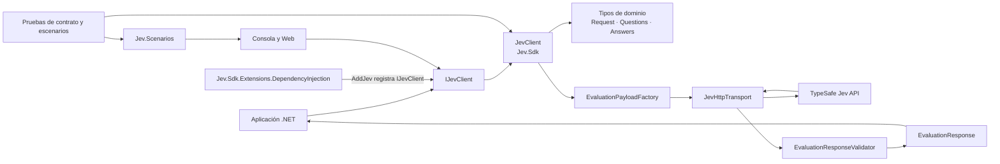
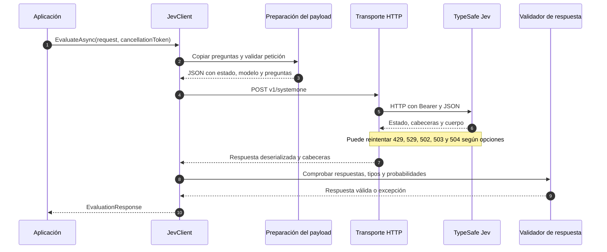

# Arquitectura y flujo de evaluación

## Vista de componentes

La solución separa el cliente HTTP y los tipos de dominio, la integración opcional con inyección de dependencias, los escenarios de demostración y las pruebas. El proyecto `Jev.Scenarios` contiene lógica reutilizada por las muestras y las pruebas.

La biblioteca central conoce los tipos de Jev y el contrato HTTP. El paquete de DI añade registro en `IServiceCollection`, sin cambiar la abstracción `IJevClient`. Las muestras muestran patrones de integración; no forman parte del paquete central.

## Flujo de una evaluación

La cancelación del llamante se propaga como `OperationCanceledException`. El timeout total cubre peticiones y esperas de reintento. Los errores HTTP, de transporte, timeout y de respuesta se describen en [errores y reintentos](../usage.md#errores-y-reintentos).

## Responsabilidades en el código

| Parte | Responsabilidad | Referencias |
| --- | --- | --- |
| Contrato y cliente | `IJevClient` expone evaluación y catálogo; `JevClient` aplica configuración y coordina el flujo. | [`IJevClient.cs`](../../src/Jev.Sdk/IJevClient.cs), [`JevClient.cs`](../../src/Jev.Sdk/JevClient.cs) |
| Modelo de dominio | Representa estado, solicitud, preguntas tipadas, respuestas y modelos disponibles. | [`EvaluationRequest.cs`](../../src/Jev.Sdk/EvaluationRequest.cs), [`Questions.cs`](../../src/Jev.Sdk/Questions.cs), [`Answers.cs`](../../src/Jev.Sdk/Answers.cs), [`ModelsResponse.cs`](../../src/Jev.Sdk/ModelsResponse.cs) |
| Adaptación del protocolo | `EvaluationPayloadFactory` adapta los tipos públicos al JSON esperado por la API; los tipos de dominio no dependen de nombres de campos HTTP. | [`EvaluationPayloadFactory.cs`](../../src/Jev.Sdk/Internal/EvaluationPayloadFactory.cs) |
| Red y diagnósticos | `JevHttpTransport` administra autenticación, timeout, reintentos, errores, cabeceras y métricas/trazas. | [`JevHttpTransport.cs`](../../src/Jev.Sdk/Internal/JevHttpTransport.cs) |
| Validación | `EvaluationResponseValidator` verifica que la respuesta incluya resultados compatibles con cada pregunta. | [`EvaluationResponseValidator.cs`](../../src/Jev.Sdk/Internal/EvaluationResponseValidator.cs) |
| Integración con DI | `AddJev` registra opciones y un `IJevClient` respaldado por `HttpClient` gestionado por la factoría. | [`ServiceCollectionExtensions.cs`](../../src/Jev.Sdk.Extensions.DependencyInjection/ServiceCollectionExtensions.cs) |

## Límites del diseño

- El SDK evalúa y consulta modelos; no genera texto de chat ni ejecuta acciones de negocio.
- Las preguntas Score son rúbricas ordenadas. El resultado puede ser fraccionario; no debe interpretarse necesariamente como un índice entero.
- La validación del SDK comprueba consistencia estructural, no la calidad semántica de la decisión.
- Las solicitudes HTTP no se reintentan ante fallos de transporte porque no puede saberse si el servidor llegó a procesarlas.
- La integración de DI y el cliente propio desactivan redirecciones para evitar reenviar la credencial a otro destino.

Para las opciones, precedencia de configuración, excepciones y detalles operativos, consulta [uso y comportamiento](../usage.md). Para probar estos flujos con casos completos, consulta el [tutorial de ejemplos](../examples.md).
