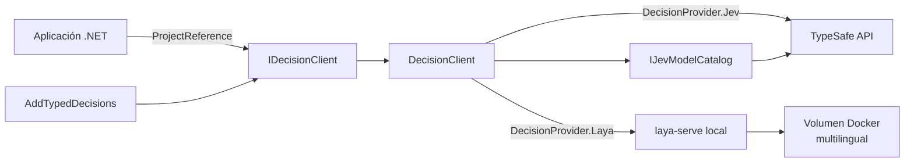

# Arquitectura y flujo de evaluación

`DecisionRequest` lleva el proveedor, estado y preguntas. [`DecisionClient`](../../src/TypedDecisions.Sdk/DecisionClient.cs) elige la configuración y el transporte correspondiente. [`DecisionPayloadFactory`](../../src/TypedDecisions.Sdk/Internal/DecisionPayloadFactory.cs) crea el JSON compartido; [`DecisionHttpTransport`](../../src/TypedDecisions.Sdk/Internal/DecisionHttpTransport.cs) envía la petición, añade solo la clave de ese proveedor y gestiona timeout y reintentos. [`DecisionResponseValidator`](../../src/TypedDecisions.Sdk/Internal/DecisionResponseValidator.cs) comprueba tipos, probabilidades y respuestas antes de entregarlas. Las pruebas de contrato están en [`tests/`](../../tests/).

La aplicación referencia [`TypedDecisions.Sdk.csproj`](../../src/TypedDecisions.Sdk/TypedDecisions.Sdk.csproj) directamente. Si utiliza `AddTypedDecisions`, también referencia el [proyecto de integración con DI](../../src/TypedDecisions.Sdk.Extensions.DependencyInjection/TypedDecisions.Sdk.Extensions.DependencyInjection.csproj). El [README](../../README.md) muestra el fragmento `ProjectReference`.

El catálogo de modelos pertenece a Jev mediante [`IJevModelCatalog`](../../src/TypedDecisions.Sdk/IJevModelCatalog.cs). Laya local usa el servidor oficial fijado a `v0.3.20` y un volumen persistente, gestionados por [`laya-local.sh`](../../scripts/laya-local.sh). El SDK no ejecuta los pesos ni inicia Docker por sí mismo.

La cancelación del llamante conserva `OperationCanceledException`; un timeout interno produce `DecisionTimeoutException`. Las respuestas preservan metadatos adicionales de Laya, como `routing` y `answer_confidence`. La validación verifica estructura, no la calidad de la predicción. Consulta [uso](../usage.md) y las [fuentes externas](sources.md).
